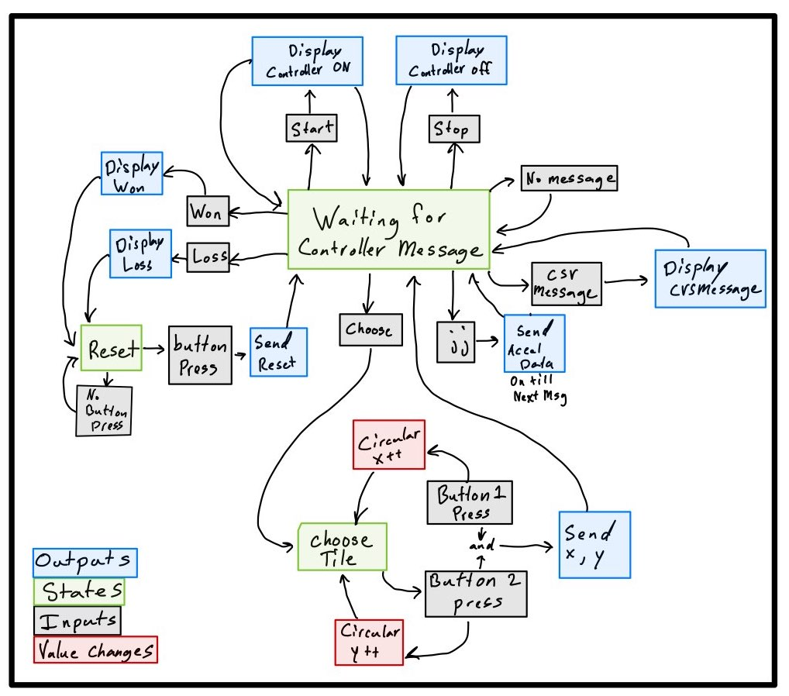

# Final Project | 12/07/2021 :writing_hand:
### Prepared by:  
> Muhammad Fadli Alim Arsani :boy: | A16468481  
> Justin Volheim :man: | A16582348  

</br>  

Table of contents :bookmark_tabs:
=================================
* [Final Project Objective](#final-project-objective-mag)
* [Python Sockets Tutorial](#python-sockets-tutorial-memo)
  * [Objectives](#objectives-bulb)
  * [Implementations of Tutorial](#implementations-of-tutorial-computer)
* [Grand Challenge 1](#grand-challenge-1-trophy)
  * [Objectives](#objectives-bulb-1)
  * [Discussions of Improvements & Features](#discussions-of-improvements--features-hammer_and_wrench)
  * [Controller Instructions](#controller-instructions)
  * [Implementations](#implementations-gc1-computer)
  * [Demo](#demo-gc1-clapper)
* [Grand Challenge 2](#grand-challenge-2-trophy)
  * [Descriptions & Discussions](#dummy)
  * [Features](#features-star2)
  * [Controller Instructions](#dummy)
  * [Implementations](#implementations-gc2-computer)
  * [Demo](#demo-gc2-clapper)
* [Teammates Roles](#teammates-roles-boy-man-)

</br>  

Final Project Objective :mag:
=============================
</br> 
The final project of ece 16 was designed to give us as students the opportunity to apply all the knowledge we have learned throughout the quarter towards 
an in depth design based project. This project test not only our understanding of the course material but also our ability to apply it to new challenges not
defined by the teaching staff.  

Python Sockets Tutorial :memo:
==============================
Objectives :bulb:
---------------------
The objective of this tutorial is to give us a basic understanding of how socket communication works in python. This tutorial accomplishes this by giving us code for a bare bones esp32 based controller for the space invaders game. This code can be seen below and formed the basis of understanding used in the rest of this final project!  

Implementations of Tutorial :computer:
------------------------------
</br> 
This code is the python controller code given to us which demonstrates how to bridge a pygame with the esp32 using sockets and bluetooth communication. It also implements some basic functionality of the game to work with the controller. 

```python
"""
@author: Ramsin Khoshabeh
"""

from ECE16Lib.Communication import Communication
from time import sleep
import socket, pygame

# Setup the Socket connection to the Space Invaders game
host = "127.0.0.1"
port = 65432
mySocket = socket.socket(socket.AF_INET, socket.SOCK_DGRAM)
mySocket.connect((host, port))
mySocket.setblocking(False)

class PygameController:
  comms = None

  def __init__(self, serial_name, baud_rate):
    self.comms = Communication(serial_name, baud_rate)

  def run(self):
    # 1. make sure data sending is stopped by ending streaming
    self.comms.send_message("stop")
    self.comms.clear()

    # 2. start streaming orientation data
    input("Ready to start? Hit enter to begin.\n")
    self.comms.send_message("start")

    # 3. Forever collect orientation and send to PyGame until user exits
    print("Use <CTRL+C> to exit the program.\n")
    while True:
      message = self.comms.receive_message()
      if(message != None):
        command = None
        message = int(message)
        # if message == 0:
        #   command = "FLAT"
        # if message == 1:
        #   command = "UP"
        if message == 2:
          command = "FIRE"
        elif message == 3:
          command = "LEFT"
        elif message == 4:
          command = "RIGHT"

        if command is not None:
          mySocket.send(command.encode("UTF-8"))


if __name__== "__main__":
  serial_name = "/dev/cu.BTDemo-ESP32SPP"
  baud_rate = 115200
  controller = PygameController(serial_name, baud_rate)

  try:
    controller.run()
  except(Exception, KeyboardInterrupt) as e:
    print(e)
  finally:
    print("Exiting the program.")
    controller.comms.send_message("stop")
    controller.comms.close()
    mySocket.send("QUIT".encode("UTF-8"))
    mySocket.close()

  input("[Press ENTER to finish.]")
```
<br>
The pygame code is very large but these small sections demonstrate the connection code given to us from the game side!

```python

import socket
host = "127.0.0.1"
port = 65432
mySocket = socket.socket(socket.AF_INET, socket.SOCK_DGRAM)
mySocket.bind((host, port))
mySocket.setblocking(0)

def check_input_udp_socket(self):
        try:
            msg, _ = mySocket.recvfrom(1024) # receive 1024 bytes
            msg = msg.decode('utf-8')
            print("Command: " + msg)

            if msg == "QUIT":
                sys.exit()
            if msg == "FIRE":
                if len(self.bullets) == 0 and self.shipAlive:
                    if self.score < 1000:
                        bullet = Bullet(self.player.rect.x + 23,
                                        self.player.rect.y + 5, -1,
                                        15, 'laser', 'center')
                        self.bullets.add(bullet)
                        self.allSprites.add(self.bullets)
                        self.sounds['shoot'].play()
                    else:
                        leftbullet = Bullet(self.player.rect.x + 8,
                                            self.player.rect.y + 5, -1,
                                            15, 'laser', 'left')
                        rightbullet = Bullet(self.player.rect.x + 38,
                                                self.player.rect.y + 5, -1,
                                                15, 'laser', 'right')
                        self.bullets.add(leftbullet)
                        self.bullets.add(rightbullet)
                        self.allSprites.add(self.bullets)
                        self.sounds['shoot2'].play()
            else:
                self.player.update_udp_socket(msg)
        except BlockingIOError:
            pass # do nothing if there's no data

if __name__ == '__main__':
    game = SpaceInvaders()
    try:
        game.main()
    finally:
        ''' ============================================================ '''
        mySocket.close()
        ''' ============================================================ '''
```
<br>
By analyzing the above code we were able to add additional features and improvements to the space invader game controller code. 
We were also able to adapt this code for a completely new game which can be seen in challenge 2!


Grand Challenge 1 :trophy:
==========================
In this challenge, we are tasked to make a __game controller__ for the game called __Space Invader__ :space_invader:.

Objectives :bulb:
---------------------
The objective of this challenge is to __encourage students to use the knowledge they learned throughout all 7 labs__, by making a __fully-functionaly game controller__, which not only __improves the game mechanics__, but also has some __extra features__! Students work in a team of 2 and try to come up with a series of improvements and feature to add to the game. This ultimately tests their understanding in the concepts taught in the previous labs.

Discussions of Improvements & Features :hammer_and_wrench:
----------------------------------------------------------------
__Improvements:__  
1. __Smoother tilting__ when moving left and right, smooth like butter :butter:.
   - When playing the game first time, we realize the tilting is not smooth, there's no way one can be a pro player at this :frowning_face:. So, we thought why not *"clean"* the data first? Fortunately, the previous labs have equipped us with this skill. Hence, we __implemented Digital Signal Processing__, utilizing the `ECE16Lib` module, to resolve this issue! (see implementation for details).
2. __Decoupled moving and firing__, user can do both silmutaneously!
   - In any shooting games, any player would want to be able to move while shooting; this is essential to not die early and rage quit. So we decided to make this possible in the game. By sending the right command (see implementation for details), the server can interpret and respond when the player intend to both move and shoot.
3. Player can ideally and effectively __fire via button__ instead of tilting the breadboard.
   - We found out that tilting the breadboard upwards/downwards to fire is very inefficient, kind of too much work at some point for such a simple task. So we came up with the idea of using the button as the trigger to fire, which is not only more efficient but very easy to use! Full-Auto? No problemo!  

__Features:__  
1. Player can see their __score displayed on the OLED__.
   - We noticed that during the game whenever we go vibrational feedback from the other features we had a tendency to look down at the controller.
        due to this it seemed natural to add the current score to the controllers design. 
2. Making use of the __buzz motor__, player will feel __vibration on the controller__ when he/she gets hit by the space invaders! Don't worry, it ~~doesn't~~ hurts.
   - By adding vibrational feedback to the controller when the ship is hit the player will become more emerged in the gameplay and have a better overall experience. 
        Further, making the controller a better option to use over the standard computer controls. 
3. __Game statistics__, such as __lives count__, __game over status__,__additional vibrational feedback__ can be directly experienced from the controller
   - When playing the game we noticed that there was no real benefit in experience of gamplay while using the controller over the computer controls besides the tilting improvement, so we wanted to add some uniqueness to the controller
        which gives the player a fuller experience while playing the game.

Controller Instructions :video_game:
------------------------------------
The following is the procedure to use the controller:  
1. Upload the sketch, `SpaceInvadersController.ino` to the MCU.
2. Run the game by running the command: `python spaceinvaders.py`
3. Instantiate the client-server connection, run the command to activate the controller: `python space_invaders_controller.py`
4. Use the button to fire, and you can now fire while moving!.
5. Then, you can straight away enjoy the game!
6. If you need to see the statistics, like your lives counts, they're displayed on the OLED.
9. Enjoy!  

[Demo](https://www.youtube.com/watch?v=un4AiuLYsPA) :clapper:
------------------
> [Demo video](https://www.youtube.com/watch?v=un4AiuLYsPA)

Implementations :computer:
------------------------------
> __Improvements:__  

<ins>1. Obtaining seamless movements via DSP</ins>  
Achieving this is a two-part process: __finding the right threshold__ and __applying the DSP__. For the DSP, we applied __moving average__ on the accelerometer data coming in:  
```python
def moving_average(self, x, win):
  ma = np.zeros(100)
  for i in np.arange(0,len(x)):
    if(i < win):
      ma[i] = np.mean(x[:i+1])
    else:
      ma[i] = ma[i-1] + (x[i] - x[i-win])/win
  return ma

def process(self, target, win):
  out = self.moving_average(target, win)
  return out
```
We noticed that this was sufficient enough to give us not just smoother tilting, but less delay. Further processing didn't turn out as good as this one. As for thresholding the accelerometer value, such that it's not too sensitive, we decided to make two __sensitivity levels__ available, __level 1__ and __level 2__.  

__Level 1:__ the program will respond to a tilt (left or right) only up to __45 degrees__.  

__Level 2:__ the program will respond to a tilt (left or right) up to __90 degrees__.  

Then, from our observation, the desired thresholds for each axis are as the following:  

<ins>Stationary</ins>:     __1950__  `<=`  __x-axis__-acclerometer-value `<=` __1970__  

<ins>Tilting left</ins>:   __x-axis__-acclerometer-value `<=` __2300__  

<ins>Tilting right</ins>:  __x-axis__-acclerometer-value `>=` __1655__  

> :heavy_exclamation_mark: In both cases, __z-axis__-accelerometer-value `>` 2200

Should 2 be choosen as the sensitivity level, then those values are scaled in the following manner:  
```python
if (self.the_sensitivity == 2):
  adj_xLeft = 500
  adj_xRight = 140
  adj_z = 230

adjusted_thresLeft = 2300+adj_xLeft
adjusted_thresRight = 1655-adj_xRight
adjusted_thresZ = 2200-adj_z
```

<ins>2. Decoupling moving and firing</ins>  
This is achieved by __sending 4 different direction__ messages to `spaceinvaders.py` via socket. The following are the 4 different messages:  
- `"LFIRE"` 
  - Indicates that the player is moving __left__ (tilting left) whilst pressing the button to __fire__.
- `"LEFT"` 
  - Indicates that the player is moving __left__ only, __without firing__.
- `"RFIRE"` 
  - Indicates that the player is moving __right__ (tilting right) whilst pressing the button to __fire__.
- `"RIGHT"` 
  - Indicates that the player is moving __right__ only, __without firing__.

The server, `spaceinvaders.py` will receive one of these messages from its client `space_invaders_controller.py`.   
In `space_invaders_controller.py`, we implemented two functions as helpers in generating those messages:  

```python
def is_between(self, target, x, y):
  return (target >= x and target <= y)

def generatingCommand(self, xf_input, yf_input, zf_input, is_fire):
  adj_xLeft = 0
  adj_xRight = 0
  adj_z = 0
  if (self.the_sensitivity == 2):
    adj_xLeft = 500
    adj_xRight = 140
    adj_z = 230

  adjusted_thresLeft = 2300+adj_xLeft
  adjusted_thresRight = 1655-adj_xRight
  adjusted_thresZ = 2200-adj_z

  command = None

  x_cmd = np.array(xf_input)
  y_cmd = np.array(yf_input)
  z_cmd = np.array(zf_input)

  if (is_fire == 2):
    # shooting but not moving
    command = "FIRE"

  if (self.is_between(x_cmd[-1], 1950, 1970) == False):
    # tilting
    # az can drop to lowest to 2.2k, regardless tilted left or right
    # ax can go up to 2300 when tilt left and as low as 1655 when tilt right
    if (x_cmd[-1] <= adjusted_thresLeft and x_cmd[-1] > 1950 and z_cmd[-1] > adjusted_thresZ):
      # tilt left
      if (is_fire == 2):
        command = "LFIRE"
      else:
        command = "LEFT"
    if (x_cmd[-1] >= adjusted_thresRight and x_cmd[-1] < 1950 and z_cmd[-1] > adjusted_thresZ):
      # tilt right
      if (is_fire == 2):
        command = "RFIRE"
      else:
        command = "RIGHT"

  return command, x_cmd[-1], z_cmd[-1]
```
Then, in `run()`, we did the regular implementations of receiving accelerometer data from the MCU, process it via DSP, and etc, as previously learned from the lab assignments. See [here]) for the full source code.  

On the `space_invaders_controller.py` side, we added the following lines after the block `if msg == "FIRE"`:  

```python
...
...
elif msg == "LFIRE" or msg == "RFIRE":
    if len(self.bullets) == 0 and self.shipAlive:
        if self.score < 1000:
            bullet = Bullet(self.player.rect.x + 23,
                            self.player.rect.y + 5, -1,
                            15, 'laser', 'center')
            self.bullets.add(bullet)
            self.allSprites.add(self.bullets)
            self.sounds['shoot'].play()
            # added - Fade
            self.player.update_udp_socket(msg)
            # ...
        else:
            leftbullet = Bullet(self.player.rect.x + 8,
                                self.player.rect.y + 5, -1,
                                15, 'laser', 'left')
            rightbullet = Bullet(self.player.rect.x + 38,
                                    self.player.rect.y + 5, -1,
                                    15, 'laser', 'right')
            self.bullets.add(leftbullet)
            self.bullets.add(rightbullet)
            self.allSprites.add(self.bullets)
            self.sounds['shoot2'].play()
            # added - Fade
            self.player.update_udp_socket(msg)
            # end of additions ...
else:
    self.player.update_udp_socket(msg)
...
...
```
And then added the following lines in the `update_udp_socket()` method:  

```python
def update_udp_socket(self, direction):
    if direction == "LEFT" and self.rect.x > 10:
        self.rect.x -= self.speed
    if direction == "RIGHT" and self.rect.x < 740:
        self.rect.x += self.speed
    # added - Fade
    if direction == "LFIRE" and self.rect.x > 10:
        self.rect.x -= self.speed
    # end of additions ...

    # added - Fade
    if direction == "RFIRE" and self.rect.x < 740:
        self.rect.x += self.speed
    # end of additions ...

    game.screen.blit(self.image, self.rect)
```

<ins>3. Enabling button press as firing mechanism</ins>  
As already seen in previous code snippets for the other implemtations above, the `is_fire` boolean is invoked if the button is pressed. In the `run()` method inside `space_invaders_controller.py` (I represent other lines as '...' if they are not important to demonstrate this concept):
```python
  def run(self):

    # send "start" message to MCU
    ...
    ...

    previous_time = 0
    while True:
      message = self.comms.receive_message()

      if(message != None):
        f_command = None
        try:
          (m0, m1, m2, m3, m4) = message.split(',')
        except ValueError:
          continue

        # add m1,m2,m3,m4 to ax, ay, az circular lists
        ...
        ...
        ...

        current_time = time()
        if (current_time - previous_time > self.refresh_time):
          previous_time = current_time

          # DSP
          ...
          ...

          f_command, valx, valz = self.generatingCommand(self.ax_f, self.ay_f, self.az_f, int(m0))
          # m0 = 2, means the player press the button to fire
          # m0 = 7, means the player press the button to fire
          if f_command is not None:
            mySocket.send(f_command.encode("UTF-8"))

        # receives message from server (for displaying game statistics on OLED)
        ...
        ...
        ...
```
The value of `m0` is determined by the button press. In the arduino side, `SpaceInvadersController.ino`:  

```cpp
currentState = !digitalRead(buttonPin);
if (currentState != lastButtonState) { 
  if (oldStatus) {
    isShoot = false;
  }
  if (oldStatus == false) {
    isShoot = true;
  }
}
lastButtonState = currentState;

// other stuffs like OLED, etc
...
...
...

if(sending && sampleSensors()) {
  String response = String(sampleTime) + ",";
  response += String(ax) + "," + String(ay) + "," + String(az);

  if (isShoot) {
    sendMessage(String(2) + "," + response);
  }
  else {
    sendMessage(String(7) + "," + response);
  }
}

...
...
```

Hence, in the `generatingCommand()` function inside our client `space_invaders_controller.py`, if `m0` is `2` (the player is firing), the server `spaceinvaders.py` will receive either one of these messages, `FIRE`, `LFIRE`, `RFIRE`.  

```python
def generatingCommand(self, xf_input, yf_input, zf_input, is_fire):
  # thresholding settings
  ...
  ...
  ...

  if (is_fire == 2):
    # shooting but not moving
    command = "FIRE"

  if (self.is_between(x_cmd[-1], 1950, 1970) == False):
    if (x_cmd[-1] <= adjusted_thresLeft and x_cmd[-1] > 1950 and z_cmd[-1] > adjusted_thresZ):
      # tilt left
      if (is_fire == 2):
        command = "LFIRE"
      else:
        command = "LEFT"
    if (x_cmd[-1] >= adjusted_thresRight and x_cmd[-1] < 1950 and z_cmd[-1] > adjusted_thresZ):
      # tilt right
      if (is_fire == 2):
        command = "RFIRE"
      else:
        command = "RIGHT"

  return command, x_cmd[-1], z_cmd[-1]
```

> __Features:__  

<ins>1. Displaying score and lives on the OLED</ins>  

In order to display the score and life count on the esp32 code changes were required in spaceinvaders.py, space_invaders_controller.py and 
SpaceInvadersController.ino. These changes can be seen as follows.


This code is part of the spaceinvaders.py file that needed to be changed inorder to send the correct lives and score data to the esp32
In the first section we can see the code in the main loop that Creates and sends a CSV message to the python controller code. 
In the second section we can see the code that needed to be edited to keep track of the current number of lives
```python
    def main(self):
        while True:
            #other code 
            ...
            ...
        
            elif self.startGame:
                if not self.enemies and not self.explosionsGroup:
                    # other code
                    ...
                    ...
                    ...
                    
        # sends data to oled only if a new value has occured
                    if self.score != self.lastscorecount or self.lastlifecount != self.livesLeft:
                        mySocket.sendto(("Lives Left:" + str(self.livesLeft) + "    ," + "Score: " + str(self.score) + "   ").encode("utf-8"),address)  
                        # sends Score and life notification to socket
                        self.lastlifecount = self.livesLeft
                        self.lastscorecount = self.score


# The edits in this code allow for tracking of number of lives left
class SpaceInvaders(object):
    #...other functions
    #...
    def check_collisions(self):
            for player in sprite.groupcollide(self.playerGroup, self.enemyBullets,
                                          True, True).keys():
            #mark
            if self.life3.alive():
                self.livesLeft -= 1
                self.life3.kill()
            elif self.life2.alive():
                self.livesLeft -= 1
                self.life2.kill()
            elif self.life1.alive():
                self.livesLeft -= 1
                self.life1.kill()
            else:
                self.gameOver = True
                self.startGame = False
           
            #other Code
            ...
            ...    
```
This is the code added inside the main loop of the space_invaders_controller.py file that is reused for several features.
It is designed to simply check for any messages coming from the Game and sends them to the 
esp32.
```python
    # check if server is sending any commands
        try:
            data = mySocket.recv(1024)
            data = data.decode("utf-8")
            controller.comms.send_message(data)
        except BlockingIOError:
            pass  # do nothing if there's no data

```


This is a trimmed down version of the arduino code that shows the key code components that support updating the 
score and number of lives on the oled screen. Basically if a CSV string is sent that doesn't match the other commands that string will be displayed
on the oled screen.
```cpp
void loop(){
 String command = receiveMessage();
 
 // other commands
 
 // prints CSV messages to oled
 else if (command != ""){
    writeDisplayCSV(command,1);
  }
 // Sample data code
 // Firing Code
 //Motor control Code
  }
```

<ins>2. Buzzing the motor when getting hit</ins>  

Inorder to impliment the motor buzzing feature when hit by a bullet the following code addition/ammendments were required.

This is the code from the spaceinvaders.py file. The change made was to check if the game had ended after being hit by a bullet and if not then
send a Hit command to the esp32
```python
class SpaceInvaders(object):
    #...other functions
    #...
    def check_collisions(self):
        for player in sprite.groupcollide(self.playerGroup, self.enemyBullets,
                                          True, True).keys():
            # code for updating life count
            #...
            #...
            if not self.gameOver:
                ''' =========================================================================================== '''
                mySocket.sendto("Hit".encode("utf-8"), address)   # sends hit notification to socket
                ''' =========================================================================================== '''

            self.sounds['shipexplosion'].play()
            ShipExplosion(player, self.explosionsGroup)
            self.makeNewShip = True
            self.shipTimer = time.get_ticks()
            self.shipAlive = False
```
This is the code added inside the main loop of the space_invaders_controller.py file that is reused for several features.
It is designed to simply check for any messages coming from the Game and sends them to the 
esp32.
```python
    # check if server is sending any commands
        try:
            data = mySocket.recv(1024)
            data = data.decode("utf-8")
            controller.comms.send_message(data)
        except BlockingIOError:
            pass  # do nothing if there's no data
```

This is the arduino code that supports the vibration command from the game code when hit. This code works by waiting for the "hit" command 
to then start the motor and set a timer to shut it off half a second later.
```cpp
void loop(){
 String command = receiveMessage();
 
 // other commands
 
  // vibrate motor and display hit
  if(command == "Hit") { // player is hit by bullet
    writeDisplay("You've been Hit!", 0, true);
    vibrate = true;
    timer1 = currentMillis;
    activateMotor(255); // buzz motor
  }
  
 // Sample data code
 // Firing Code
 
 
 // turn off motor after 0.5 seconds
  if(vibrate && (currentMillis - timer1 >500)){
    vibrate = false;
    deactivateMotor();
  }
  }
```

<ins>3. Integrating game statistics</ins>  

To add the game over / you died feature to the arduino Oled display with vibrational feedback the following code changes were required

The first code change was inside the game to learn when the game had ended an relay this information over to the python controller whihc could then pass it to the esp32
```python
class SpaceInvaders(object):
    #...other functions
    #...
    def check_collisions(self):
        for player in sprite.groupcollide(self.playerGroup, self.enemyBullets,
                                          True, True).keys():
            #mark
            if self.life3.alive():
                self.livesLeft -= 1
                self.life3.kill()
            elif self.life2.alive():
                self.livesLeft -= 1
                self.life2.kill()
            elif self.life1.alive():
                self.livesLeft -= 1
                self.life1.kill()
            else:
                self.gameOver = True
                self.startGame = False
                ''' =========================================================================================== '''
                mySocket.sendto("Dead".encode("utf-8"), address)  # sends Game over notification to socket
                ''' =========================================================================================== '''

        #... other code
        #...
```

This is the code added inside the main loop of the space_invaders_controller.py file that is reused for several features.
It is designed to simply check for any messages coming from the Game and sends them to the 
esp32.
```python
    # check if server is sending any commands
        try:
            data = mySocket.recv(1024)
            data = data.decode("utf-8")
            controller.comms.send_message(data)
        except BlockingIOError:
            pass  # do nothing if there's no data
```

This is the arduino code! The code works by waiting for a "Dead" comand and when recived displaying "You Died" to 
the oled. It also will start the motor and set a timer to turn it off in 1 second.
```cpp
void loop(){
 String command = receiveMessage();
 
 // other commands
 
  // displays final death / gameover and vibrates motor
 else if(command == "Dead") { // player loose :(
    sending = false;
    writeDisplay("You Died!!!", 0, true);
    vibrate = true;
    timer1 = currentMillis+500;
    activateMotor(255); // buzz motor
  }
  
 // Sample data code
 // Firing Code
 
 // turn off motor after 0.5 seconds
  if(vibrate && (currentMillis - timer1 >500)){
    vibrate = false;
    deactivateMotor();
  }
  }
```

</br>  

Grand Challenge 2 :trophy:
==========================
For this Design Challenge, we choose to make a __game controller__ for the famous classic __Mine Sweeper__ game!

Descriptions & Discussions :bulb:
---------------------------------
The idea of this design challenge is to build a fun light work-out environment for people who like staying at home, especially during the pandemic (though it's almost over, is it? :thinking:). By *"forcing"* the player to do a certain number of jumping jacks to be granted the tile of his/her choosing, he/she for sure sweat!  

In terms of how is this project relevant to ECE16, we believe it encompasses everything that was taught in this class, from as basic as good __Object-Oriented Programming__ implementation, to __Digital Signal Processing__, concepts of __Finite State Machines__ in deriving a solution effectively and efficiently, and etc.  

TLDR:  
> Our goal is to make this old game enjoyable again, and promotes healthy lifetyle, especially during this pandemic LOL. It looks simple, but it's tiring :cold_sweat: !

Features :star2:
----------------
__Features:__  
1. Players can __select tiles, restart game, by pressing the button on the MCU__, eliminating the need to interact with the keyboard/mouse.
   - We want to give a 'workout-like' experience to the user; think of the controller like a skipping rope handle. While working out, in this case doing the jumping jacks, we wouldn't want the user to go back and forth interacting with the keyboard/mouse. Thus, we made everything is at a touch of a button.
2. Accurate jumping jacks counter, achieved via __Digital Signal Processing__.
   - We implemented __moving average__ on the __*l1-norm*__ of the three axes coming in from the accelerometer sensors. Doing this __eliminate the noise__, and make it __more reliable__.
   - Then using the `find_peaks()` method from the `scipy.signal` module, we calculated the peaks that indicates a valid jumping jack.
   - All of this is made even simpler thanks to our `ECE16Lib` which we built upon finishing series of labs in this class!
3. __Game statistics__, displaying __jumping jack counts__ on the OLED display.
   - As mention in point no. 1, the user can directly look at the OLED display to know how many more jumping jacks are needed to select the tile they choose.

Controller Instructions :video_game:
------------------------------------
The following is the procedure to use the controller:  
1. Upload the sketch, `MineSweeper.ino` to the MCU.
2. Run the game by running the command: `python Minesweeper.py`
3. Instantiate the client-server connection, run the command to activate the controller: `python minesweeper_controller.py`
4. You will be asked to select a tile. Input the `x` and `y` coordinates, where __x is the m'th row__, and __y is the n'th column__. Do this by pressing the button on the breadboard(x-coord), and the built-in button (y-coord) on the microcontroller. You will see your selection on the OLED display.
5. Then, the program will calculate the required number of jumping jacks you need to do to grant you that tile, in the following way:
   - `number of jumping jacks = | (previous x-coord - current x-coord) | + | (previous y-coord - current y-coord) |`
6. Do the jumping jacks! After satisfying the jumping jacks counts, your tile will be selected on the game.
7. Continue playing until you win/lose, good luck :thumbsup: !
8. If you win/lose and would like to restart the game, press the button once.
9. Enjoy!

[Demo](https://www.youtube.com/watch?v=rpel16tBC4Y) :clapper:
------------------
> [Demo video](https://www.youtube.com/watch?v=rpel16tBC4Y)

Implementations :computer:
------------------------------
The main minesweeper game code for this challenge is downloaded from pygames online. It basically allows for the 
creation of a 7x7 grid with a set number of mines randomly hidden under the tiles. The additions and changes required to 
work with our controller and desired features are as follows. Allow for grid based selection of tiles vs the original click based system
and the transmission of relevant data back and forth from the python controller to the game. With these upgrade we are able to select tiles and
reset the game from the esp32 as well as display the end game state on the controllers oled screen. The relevent additions can be seen bellow. 
For the full code click [here](DesignChallenge/MineSweeper/Minesweeper.py).

This first code shows the setup of the socket connection required to communicate with the python controller code and
a function designed to check for socket messages when called.
```python
    # SERVER
import socket
host = "127.0.0.1"
port = 65432
mySocket = socket.socket(socket.AF_INET, socket.SOCK_DGRAM)
mySocket.bind((host, port))
mySocket.setblocking(0)
print("UDP server listening on port {0}.\n".format(port))

# this functions checks incoming message from client
def check_input_udp_socket():
    msg = None
    addr = 0
    try:
        msg, addr = mySocket.recvfrom(1024) # receive 1024 bytes
        msg = msg.decode('utf-8')
    except BlockingIOError:
        pass # do nothing if there's no data
    return msg, addr
```
This section of code shows how the reset and tile commands are proccesed in the game code. 
First is the reset if statement followed by an import of the coordinates selected by the player. It is 
important to note that the coordinates are scaled and shifted to be equal to the mouse click representation of each tile. 
```python
 # check if player pressed button to reset game and play again
        msg, addr = check_input_udp_socket()
        clickstat = None
        if msg is not None:
            if msg == "R" and (gameState == "Game Over" or gameState == "Win"):
                gameState = "Exit"
                gameLoop()
                break;

            try:
                address = addr
                (clickstat, x, y) = msg.split(',') 
                # receives coordinate from client as specified by player
                print("You selected tile at " + str(x) + ", " + str(y))
                # conversion equations (explained in detail in README.md)
                x_shifted = int(x) * 31 + 34 
                y_shifted = int(y) * 33 + 116

            except ValueError:  # if corrupted data, skip the sample
                continue

        if clickstat == "click":
            for i in grid:
                for j in i:
                    # pass the coordinates to the collidepoint()
                    # function
                    if j.rect.collidepoint((x_shifted,y_shifted)):
                        j.revealGrid()
                        # Toggle flag off
                        if j.flag:
                            mineLeft += 1
                            j.flag = False
                        # If it's a mine
                        if j.val == -1:
                            gameState = "Game Over"
                            j.mineClicked = True
```
This last piece of code simply shows the edited code allowing for win and lose commands to be sent to the controller.
```python
        if w and gameState != "Exit":
            gameState = "Win"
            
            # sends W to python controller
            mySocket.sendto(("Won").encode("utf-8"),address)  
            
        # checking game states
        if gameState != "Game Over" and gameState != "Win":
            t += 1
        elif gameState == "Game Over":
            drawText("Game Over!", 50)
            
            
            # sends L to python code
            mySocket.sendto(("Loss").encode("utf-8"),address) 
            
            
            drawText("R to restart", 35, 50)
            for i in grid:
                for j in i:
                    if j.flag and j.val != -1:
                        j.mineFalse = True
        else:
            drawText("You WON!", 50)
            drawText("R to restart", 35, 50)
```

</br>

> Python Controller Code   

The python controller code is designed to take act as both the bridge and interpreter between the pygame minesweeper and the
esp32 arduino code. It accomplishes the bridge part using a bluetooth connection to talk to the esp32 and sockets to communicate with the game. 
The interpretation is accomplished using logic and code designed in the previous labs sucha t the jumping jack counter from the pedometer class.

The main part of the python game controller can be seen bellow in the run method with the less important parts edited out to save space. If futher refrence is desired 
please see the full [Code Here.](DesignChallenge/MineSweeper/controller/Python/minesweeper_controller.py)

This first section of the code checks if messages are received from the game and sends a request to the controller to select a tile.
```python
     def run(self):
        #initalising of variables and start messages
        ...
        ...
        
        #main code loop
        while True:
            #check for messages from the game code
            try:
                # send W/L message to MCU
                data = mySocket.recv(1024)
                data = data.decode("utf-8")
                if not GameOver:
                    controller.comms.send_message(data)
                if data != None:
                    GameOver = True

            except BlockingIOError:
                pass  # do nothing if there's no data

            # ask player to input(choose) coordinate
            if sendChoose and not GameOver:
                controller.comms.send_message("choose")
                sendChoose = False
```
This section of code handles all incoming messages from the esp32 and sorts them into either a valid tile choice or the reset command!
```python
            # receives coordinates inputted by player
            message = self.comms.receive_message()
            if message != None:
                print(message)

            if (message != None) and not GameOver:
                print("Waiting for User to enter coordinates...")
                try:
                    (x, y) = message.split(',')
                    jj_n = abs(prev_x - int(x)) + abs(prev_y - int(y))
                    # [where 'jj_n' is the number of jumping jacks needed]
                    print("Jumping Jacks required: " + str(jj_n))
                    prev_x = int(x)
                    prev_y = int(y)
                    sendChoose = True # update sendChoose
                    isClicked = True  # update isClicked for jumping jacks later
               
                except ValueError:  # if corrupted data, skip the sample
                    continue

            if (message != None) and (message == "Reset\r\n"):   # reset game
                mySocket.send(("R").encode("UTF-8"))
                prev_x = 0
                prev_y = 0
                GameOver = False
                sleep(0.5)
                try:
                    a = mySocket.recv(1024)
                except BlockingIOError:
                    pass  # do nothing if there's no data

```
This last section of code handles the counting of jumping jacks till the player has accrued enough currency to send the command to the game. 
```python
            f_command = None
            if (isClicked):
                validate = True     # ask for jumping jacks
                self.ped.resetVal() # reset jumping jacks value
                prev_time = 0
                self.comms.clear()
                
                
                # send message to MCU, begin taking sensor data
                controller.comms.send_message("jj")
                while (validate):
                    msg = self.comms.receive_message()
                    if(msg != None):
                        try:
                            (m1, m2, m3, m4) = msg.split(',')
                        except ValueError:
                            continue

                        # add the new values to the circular lists
                        self.ped.add(int(m2),int(m3),int(m4))

                        current_time = time()
                        if (current_time - prev_time > self.ref_t):
                            prev_time = current_time
                            # begin  processing data
                            track_jumps, peaks, filtered = self.ped.process()
                           
                            controller.comms.send_message("Jumping Jacks   ,Required: "+str(jj_n-track_jumps))
                            if (track_jumps >= jj_n):
                                validate = False # update validate

                # display number of jumping jacks completed
                controller.comms.send_message("Jumping Jacks!  ,Completed!!!    ")
                       
                f_command = "click" + "," + str(x) + "," + str(y)

            # send command(coordinate) to server
            if f_command is not None:
                mySocket.send(f_command.encode("UTF-8"))
                sleep(0.5)
                try:
                    a = mySocket.recv(1024)
                except BlockingIOError:
                    pass  # do nothing if there's no data

            isClicked = False # reset isClicked status to False

```

</br>

> Arduino Controller Code  

The Arduino code uses several states to direct the inputs from the accelerometer, buttons, and bluetooth serial port 
to the necessary Outputs such as the bluetooth serial, Display and motor! The code does this by utilizing several of
the code files used in previous labs such as Accelerometer, Communication, Display, Motor and sampling. The state diagram 
of this code can be found below to make understanding the arduino code a bit easier.  

<ins>__State Diagram__</ins>  



</br>  

The arduino code this state diagram refers to can be seen below.  

This first segment shows the set-up of variables and initialization of buttons and code blocks.  

```cpp
    // Acceleration values recorded from the readAccelSensor() function
int ax = 0; int ay = 0; int az = 0;
int ppg = 0;              // PPG from readPhotoSensor() (in Photodetector tab)
int sampleTime = 0;       // Time of last sample (in Sampling tab)
const int buttonPin1 = /*0;*/ 12;
const int buttonPin2 = 0; /*12;*/
int x = 0;
int y = 0;
bool sending, oldStatus1, oldStatus2, both;

// for tracking button states
int currentState1 = 0;
int lastButtonState1;
int currentState2 = 0;
int lastButtonState2;
bool bothlast = false;
bool resetState = false;

void setup() {
  setupAccelSensor();
  setupCommunication();
  setupDisplay();
  setupPhotoSensor();
  setupMotor();
  sending = false;

  writeDisplay("Ready...", 1, true);
  writeDisplay("Set...", 2, false);
  writeDisplay("Play!", 3, false);

  pinMode(buttonPin1, INPUT_PULLUP);
  pinMode(buttonPin2, INPUT_PULLUP);
}
```

This second section shows the beginning of the code loop with the start and stop commands.
```cpp
void loop() {

  String command = receiveMessage();
  if(command == "stop") {
    writeDisplay("Controller: Off", 0, true);
  }

  else if(command == "start") {
    writeDisplay("Controller: On", 0, true);
  }

```
This third section shows the choose command which allows the player to select a tile based on button presses
and send that choice to the python code based on if both buttons are pressed together. 
```cpp
  else if(command == "choose") { 
    // player is choosing coordinate
    sending = false;
      
    while(1) {
      writeDisplay("Select Tile!", 0, true);
      String h = "x: "+String(x)+" y: "+String(y);
      writeDisplay(h.c_str(), 1, false);
      currentState1 = !digitalRead(buttonPin1);
      currentState2 = !digitalRead(buttonPin2);

      // sending to computer
      both  = currentState1 && currentState2;
      // if button 1 and 2 send and break
      if(both != bothlast) {
        if(both) {
          writeDisplay("Selecting",0,true);
          sendMessage(String(x)+","+ String(y));
          break;
        }
      }
      bothlast = both;
      
      // if button 1 ++
      if (currentState1 != lastButtonState1) { 
        if (currentState1) {
          x++;
        }
        if(x == 7) {
          x = 0;
        }
      }
      lastButtonState1 = currentState1;

      // if button 2 ++
      if (currentState2 != lastButtonState2) { 
        if (currentState2) {
          y++;
        }
        if(y == 7) {
          y = 0;
        }
      }
      lastButtonState2 = currentState2;
    }
  }
```
This section of code shows the remaining available commands, jj to start sending accelerometer data,
Won to display a winning message, Loss to display a Game over message and a standard command allowing 
us to send any CSV message to be displayed on the oled display.

```cpp
  else if(command =="jj") {
    // ready to track jumping jacks
    sending = true;
    writeDisplay("",0,true);
  }
  else if(command == "Won")  {
    // player won the game, ask if he wants to restart
    writeDisplay("You Won!!!      ",0,true);
    writeDisplay("Press R to reset",1,false);
    resetState = true;
  }
  else if(command == "Loss") {
    // player lose the game, ask if he wants to restart
    writeDisplay("Game Over!      ",0,true);
    writeDisplay("Press R to reset",1,false);
    resetState = true;

  }
  else if(command != "") {
    // display number of jumping jacks done
    writeDisplayCSV(command,1);
  }
```
This final section of code shows the reset state and the sending of accelerometer 
data to the python controller code.
```cpp
  if(resetState){
    // check if reset, send it to python
    resetState = false;
    sending = false;
    x=0;
    y=0;
    delay(500);
    while(1){
      currentState1 = !digitalRead(buttonPin1);
      if (currentState1 != lastButtonState1) {
        if (currentState1) {
          sendMessage("Reset");
          break;
        }
      }
      lastButtonState1 = currentState1;
    }
  }
  if (sending && sampleSensors()) {
    // collect sensor data
    String response = String(sampleTime) + ",";
    response += String(ax) + "," + String(ay) + "," + String(az);
    sendMessage(response);
  }
}
```

</br>

Teammates Roles :boy: :man: :
=============================
<ins>__Muhammad Fadli Alim Arsani :boy:__</ins>  

- __Challenge 1__
  - Impelemented DSP to provide smoother movement (tilting).
  - Decoupled firing and movement, for better gaming experience, increasing the chances of becoming a pro gamer in Space Invader.
  - Switch firing mechanism from tilting the breadboard up/down to simply pressing the button.
- __Challenge 2__
  - Refactor original code of the minesweeper game, enabling our python program to be the one initiating tile selection and not the mouse.
  - Jumping jack detection via DSP.
  - Manage the processing of the jumping jack count, i.e: when should the program start sensing for jumping jacks.

<ins>__Justin Volheim :man:__</ins>  

- __Challenge 1__
  - Lives and score count display features, making sure player are engaged both with the controller and the game itself.
  - Vibrational feedback and display when hit, creating an immersive gameplay.
  - GameOver display and vibrational feedback.
- __Challenge 2__
  - Arduino state design and implementation, for a clean, effective, easy-to-debug, and reliable end product.
  - Communication between game, python controller and esp32.
  - Eliminate the need of retrieving a specific cursor coordinate on game window by implementing tile selection logic, .
  - Display features to keep the player updated with their game statistics and engaged with the game.


